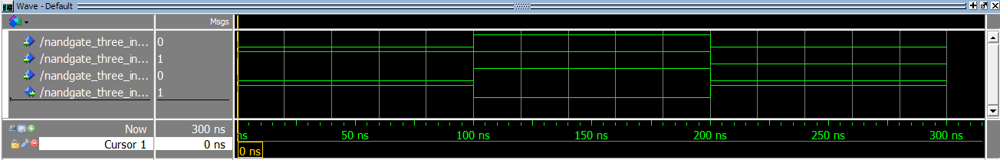

# VHDL-codes-combinational-circuits

This project contains all of the VHDL codes for combinational circuits that I have practiced.
The outputs of the codes are as follows and the codes are provided in the respective repositories.

## 4-bit binary adder (with 1bit carry)
.png)
## A Generic decoder circuit

## Full Adder (1bit)
/Full_Adder_1bit.png)
## MUX (4 to 1)

## NAND Gate (3 input)

